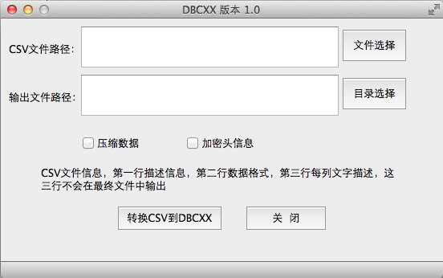

# 快速处理静态数据

在游戏中不会产生变化的基础数据为静态数据，比如技能属性，物品属性等，在RPG或模拟经营类游戏，用到静态数据的地方尤其多，使用也非常频繁，因为物品、道具、技能、任务等的基础数据都是静态数据，因此怎么高效的处理静态数据也值得研究一下。

##需求

静态数据对游戏而言就是只读数据，所以不用考虑数据保存的问题，静态数据在游戏运行期间不会有增删改的需求，所以不用考虑数据地址变动问题，根据这两个特性，快速的处理静态数据主要考虑数据加载和数据的查找都要快速和高效。

###数据加载
数据加载和数据的保存方式是相关的，个人接触过的静态数据保存有三种模式：保存到数据库，保存到文本，保存到自定义格式。

####保存到数据库
这种在服务器端比较常见，把静态数据保存在MYSQL或SQL SERVER等数据库中，服务器启动从数据库加载，如果静态数据比较多，可以看到服务器加载个几分钟静态数据，这样处理的好处是静态数据和动态数据（比如人物的经验值、金钱、等级等）统一处理。在客户端也有这样处理的，但在客户端用MYSQL或SQL SERVER不经济，所以像SQLite这种内存数据库就有了用武之地。

用数据库保存静态数据，在程序启动的时候从数据库读数据，数据库会在内存中维护一份用到的数据，程序再把读到的数据赋值给相关的[struct](http://baike.baidu.com/view/1534200.htm)，在特定时间会在内存维护两份数据，会有一次把一份数据赋值给另一份数据的操作，如果静态数据比较多，这个简单的操作也是比较费时的，在服务器端这个耗时操作可以接受，毕竟服务器内存大，程序启动一次，如果不崩溃可以一直运行，但是在客户端，如果按这种方式处理静态数据就有点不经济，所以不考虑。

####保存到文本
把静态数据保存成xml格式或者json格式，这个除了描述信息方便，用起来比较不经济，所以多是在游戏配置信息部分见到用。另一种见用到的保存方式为：CSV格式，这个因为可以用EXCEL作为数据编辑器，比较方便策划。

保存静态数据到文本，在程序启动加载静态数据的时候，文本解析部分要解析文本，会在内存中维护一份用到的数据，程序再把读到的数据赋值给相关的[struct](http://baike.baidu.com/view/1534200.htm)，在特定时间会在内存维护两份数据，会有一次把一份数据赋值给另一份数据的操作，会有文本的解析，如果静态数据比较多，这些操作也是比较费时的。所以不考虑。

####保存到自定义格式
自定义保存格式，见到的基本是按[struct](http://baike.baidu.com/view/1534200.htm)，直接把数据写到文件中，这样处理好处是，加载的时候，在内存按[struct](http://baike.baidu.com/view/1534200.htm)和数据数量分配好内存，然后读取磁盘上的文件直接到分配好的内存，然后就可以直接使用了，没有从其它数据源的读取再解析，没有从其它数据源的再赋值，所以效率非常高。

但是这种方式因为字节对齐的问题，如果跨平台，在使用的时候是有些限制的，并且要额外提供专用数据编辑器，会多做些工作，但是高效这一优点应该是值得多做些工作的。

###数据查找
数据查找见到的多是hash_map和二分查找，但是再快也是要找一下的，像静态数据在程序运行过程中又不会增删改，所以一步到位是最理想了，要做到一步到位，就只有数据的索引(ID)等同于数据在数组的下标，这样在内存中查找数据就非常快了。而这样做又非常简单，只要和策划沟通好，编辑静态数据的时候，数据索引(ID)从0逐渐递增就可以了，在程序内存中，根据数据索引(ID)和数组下标的对应关系，直接分配到对应数组区间，这样查找的时候，直接是数组下标定位数据，非常快。

##解决方案

根据以上需求，要做到对静态数据的快速加载和快速查找，1、数据索引(ID)从0逐渐递增。2、数据文件按程序的[struct](http://baike.baidu.com/view/1534200.htm)保存数据。比较知名的符合这个的就是魔兽世界的dbc文件。

###DBC格式
dbc格式，是魔兽世界静态数据的保存格式，对它的解析可以看[arcemu（点击浏览）](https://github.com/arcemu/arcemu)这个开源服务器的dbc部分。个人觉得在魔兽世界实际处理dbc数据的时候，应该比[arcemu（点击浏览）](https://github.com/arcemu/arcemu)处理的更高效，魔兽世界的dbc文件，数据索引(ID)从0逐渐递增，数据基本是按程序的[struct](http://baike.baidu.com/view/1534200.htm)保存，为了避免跨平台因字节长度或字节对齐造成的问题，在数据类型上以4字节为主，比如int,unsigned int,float,避免使用char、short、long？？？

**因为字符串长度不确定，如果[struct](http://baike.baidu.com/view/1534200.htm)中有字符串字段，直接被一起保存到文件，会在加载时，因为字符串的长度不确定，要动态的计算的地方太多，dbc格式对此的解决方式就比较高，把字符串和其它数据分开存储，把字符串都放到一起，形成字符串区域。[struct](http://baike.baidu.com/view/1534200.htm)中的字符串字段，在文件中保存的是所用字符串在字符串区域的偏移地址。这个处理方式非常赞，可以加载的时候不用做动态计算，也可以在寻址的时候，直接找到对应字符串。**

> 根据以上，对比需求，可以看出dbc格式满足快速加载和快速查找的这两项需求。

###DBCXX格式
dbcxx格式和dbc格式没有什么本质区别，是个人仿照dbc格式处理自己用到的静态数据。1、数据索引(ID)从0逐渐递增。2、dbcxx文件按程序的[struct](http://baike.baidu.com/view/1534200.htm)保存数据。3、字符数据和其它类型分开存储，有单独的字符区域。只要符合这三条，就可以做到加载静态数据最快，查找最快。

> 注意：DBCXX文件保存的字符串，为utf-8格式。

###工具
网上有一些dbc数据编辑器，[MaNGOS（点击浏览）](https://github.com/mangos)这个开源服务器，还自带一个有源码的dbc数据编辑器，但是这些编辑器，对策划而言，那个有EXCEL强大呢，所以最理想的就是EXCEL直接导出dbc数据，本计划要写个EXCEL插件，但是因为用的mac机器，做EXCEL插件开发不方便，所以就做了一个csv到dbcxx格式的转换器，策划用EXCEL编辑静态数据，导出CSV格式，然后再用工具转换到dbcxx格式就可以了。

####静态数据编辑
因为是团队专用，所以一些规范事先确定好，程序和策划按规范做就可以了。为了静态数据的快速加载和快速访问，程序方面在定义静态数据结构的时候，要注意如下事项：

1. 为了避免跨平台因字节长度或字节对齐造成的问题，在数据类型上以4字节为主，比如int,unsigned int,float,避免使用char、short、long？？？
2. 严禁出现指针，比如指向字符串的指针，因为指针在32位和64位平台上，长度是不同的，用到指针的地方用int或unsigned int，至于怎么寻址，可以看[test.cpp（点击浏览）](https://github.com/sunjianhua/dbcxx/blob/master/test.cpp)的演示代码。

策划方面在定义静态数据结构的时候，要注意如下事项：

1. 前三行为特殊行，第一行为描述部分，第一行第一列的单元格，必须为dbcxx这个关键字（后续会加些其它功能描述，比如头加密的秘钥、MD5验证码）。

2. 第二行为每列的数据类型，这个需要根据程序定的[struct](http://baike.baidu.com/view/1534200.htm)来确定，目前支持u、c、i、f这几个类型，和程序对应关系如下： 

	|u | c | i | f|
	|----|----|----|----|
	|unsigned int| 字符串 | int | float|

3. 第三行为每列的功能描述，实际看下图就明白。
4. 从第四行为实际数据，实际索引由这行开始，索引开始值为0

实际编辑效果如下图：

####工具使用
策划在EXCEL中编辑好数据，导出为CSV格式，然后再用工具做下CSV到DBCXX格式的转换就可以提交给程序使用了，从CSV到DBCXX的工具，是用[Qt Creator（点击浏览）](http://qt-project.org/)开发，所以跨平台，并且提供[全部源码（点击浏览）](https://github.com/sunjianhua/dbcxx/tree/master/DBCEX/DBCEX)，方便根据不同的平台编译自己的版本。

如果是用64位mac，有一个[编译好的工具（点击下载）](https://github.com/sunjianhua/dbcxx/releases/download/1.0/DBCEX.zip)。

工具很简单，看界面就能对操作一目了然。

#####注意
1. 这个工具只能转换GBK编码的CSV文件，为什么这样做，是因为如果EXCEL的语言为简体中文，那么它输出的CSV文件就是GBK编码？？？而策划基本都是用简体中文的EXCEL，所以就这样处理了，如果是其它语言的，恩，估计其它语言的也看不懂这个文章。
2. 苹果的Numbers这个编辑器，默认输出的CSV文件为Unicode，如果直接用这工具会有异常。
3. 后续会加多个文件的批转换。
4. 界面中的压缩数据，目前版本没有实现，因为压缩数据会在内存做一次解压缩，不经济，并且最终程序打包的时候会整体做一次压缩，就不对dbcxx单独再压缩了，但有可能会有需要压缩的情况，后续再根据实际情况决定是否实现这个。
5. 加密头信息，目前版本没有实现，后续会实现，这个是防止玩家修改数据后再打包回去运行（比如换模型），为什么只加密头，整体加密成本太大，并且只是为防止玩家修改数据再打包回去运行，加密头就足够了。

###实际使用
####dbcxx.h
在程序中处理dbcxx文件的是：[dbcxx.h（点击浏览）](https://github.com/sunjianhua/dbcxx/blob/master/dbcxx.h)，只要加载到自己项目就可以处理dbcxx文件了，因为数据格式定的好，所以处理起来就非常简单，可以看[dbcxx.h（点击浏览）](https://github.com/sunjianhua/dbcxx/blob/master/dbcxx.h)的核心代码就十多行。

####test.cpp
如果对怎样使用不太清楚，可以参考[test.cpp](https://github.com/sunjianhua/dbcxx/blob/master/test.cpp)，这个文件，演示怎样声明满足dbcxx格式的[struct](http://baike.baidu.com/view/1534200.htm)、怎么加载dbcxx文件，怎么访问加载后数据对象里的每个数据（可以特意看下怎么访问字符串）。

[dbcxx.h（点击浏览）](https://github.com/sunjianhua/dbcxx/blob/master/dbcxx.h)是所有c++项目都可以用到的，但是[test.cpp](https://github.com/sunjianhua/dbcxx/blob/master/test.cpp)，因为输出信息的关系，用到了cocos2d-x的信息输出功能，所以这个文件只能用到cocos2d-x项目。

####spell.csv
如为了测试这个功能，手边没有CSV文件，可以下载[spell.csv](https://github.com/sunjianhua/dbcxx/blob/master/spell.csv)

###测试效果
1. 用spell.csv作为数据源。 
2. 用cocos2d-x作为开发框架，调用test.cpp和dbcxx.h。
3. 用xcode作为代码编辑器。
4. 用iphone作为程序运行平台。

spell.csv EXCEL编辑器中效果

在控制台输出效果

注意：没有在安卓机器上实际测试过，不确定安卓机器上的字节对齐和数据类型长度的规则，不确定在安卓机器上是否还能得到正确数据。

###附加信息
1. 以上数据处理方法，只限于静态数据。

2. 以上数据处理方法，最好用于，单个文件只有几兆（M）大小的静态数据，因为它是一次把数据都读进内存，占用几兆（M）内存还可以接受，像魔兽世界有的单个DBC文件几百兆(M)，在服务器一次加载正常，在客户端如果一次加载，太占用内存，并且在客户端一次加载几百兆(M)静态数据，但玩家实际玩游戏中才用到其中的1~2M静态数据，浪费太严重，所以用目前版本的静态数据处理方式就不太好。

3. 在客户端，对于超大的静态数据处理，应该是做下磁盘映射，按需适时加载数据，在程序中先根据DBC的数量，分配一个索引数组，在实际用到的时候，判断是否已加载，如果没加载再适时分配内存和加载。做磁盘映射，不要不断的打开和关闭文件，这个适时加载效率还是很高的，因为是静态数据，在客户端正常情况下，是不会出现磁盘数据变动的。这个后续版本可能会处理。

4. 在编辑器部分，用到csv解析的‘strtk.hpp’文件，来自[http://www.partow.net/programming/strtk/index.html](http://www.partow.net/programming/strtk/index.html)
